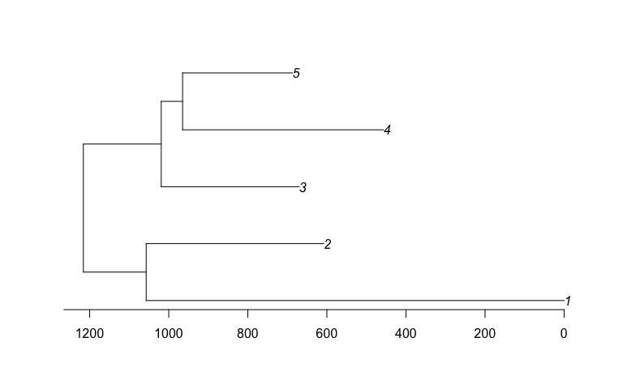
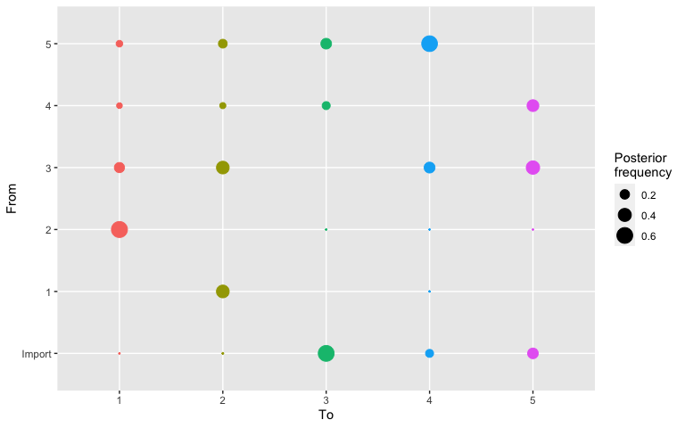
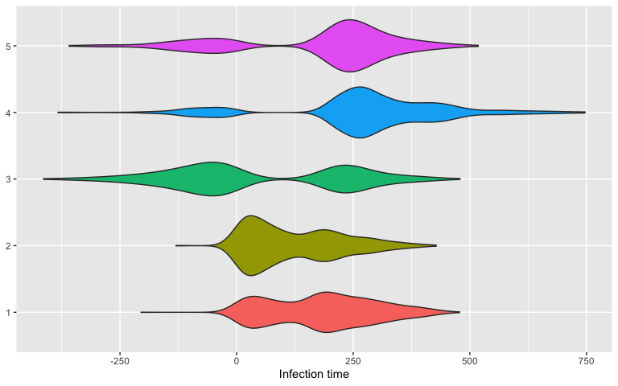

Introduction to o2mod.transphylo
================
Xavier Didelot
2021-11-17

##Initialisation

``` r
library(ape)
library(outbreaker2)
library(TransPhylo)
library(o2mod.transphylo)
set.seed(0)
```

\#\#Data

We consider a random dated tree with five leaves. Time is measured
discretely, in units of days.

``` r
nsam <- 5
phy <- rtree(nsam, br = rexp)
phy$tip.label <- 1:nsam
phy$edge.length <- round(phy$edge.length * 365)
plot(phy)
axisPhylo()
```

<!-- -->

The outbreaker2 dataset includes the sampling dates and the generation
time distribution. The genetic data is empty, but we attach the
phylogenetic tree itself. This is because the TransPhylo model works by
inferring the transmission tree based on a phylogenetic tree rather the
genetic data itself. For real datasets, the phylogenetic tree needs to
be reconstructed, for example using BEAST.

``` r
library(distcrete)
dates <- dist.nodes(phy)[nsam+1,1:nsam]
si <- distcrete("gamma", shape = 2, scale = 0.5 * 365, interval = 1L, w = 0)
w <- si$d(1:(2*max(dates)))
data <- outbreaker_data(dates = dates, w_dens = w, dna = as.DNAbin(matrix('A',nsam,1)))
data$ptree <- ptreeFromPhylo(phy, max(dates))
```

\#\#Results

Let’s run outbreaker2 using the o2mod.transphylo module:

``` r
res <- o2mod.transphylo(data)
```

Trace of the posterior probability:

``` r
plot(res)
```

<!-- -->

Ancestry matrix:

``` r
plot(res,type = 'alpha', burnin = 0.1*length(res$step))
#> Warning: `guides(<scale> = FALSE)` is deprecated. Please use `guides(<scale> =
#> "none")` instead.
```

<!-- -->

Infection dates:

``` r
plot(res, type = 't_inf', burnin = 0.1 * max(res$step))
#> Warning: `guides(<scale> = FALSE)` is deprecated. Please use `guides(<scale> =
#> "none")` instead.
```

<!-- -->

We can extract the transmission tree in the last state of the MCMC,
combine it with the phylogeny and visualize the resulting colored tree:

``` r
tinf <- rep(0, nsam)
alpha <- rep(0, nsam)
for (i in 1:nsam) {
  alpha[i] <- tail(res[[8 + i]],1)
  tinf[i] <- tail(res[[8 + nsam+i]],1)
}

alpha[which(is.na(alpha))] <- 0
ttree <- list(ttree = cbind(tinf, data$dates, alpha),
              nam = data$ptree$nam)
ctree <- combine(ttree, data$ptree)
plotCTree(ctree)
```

<!-- -->
